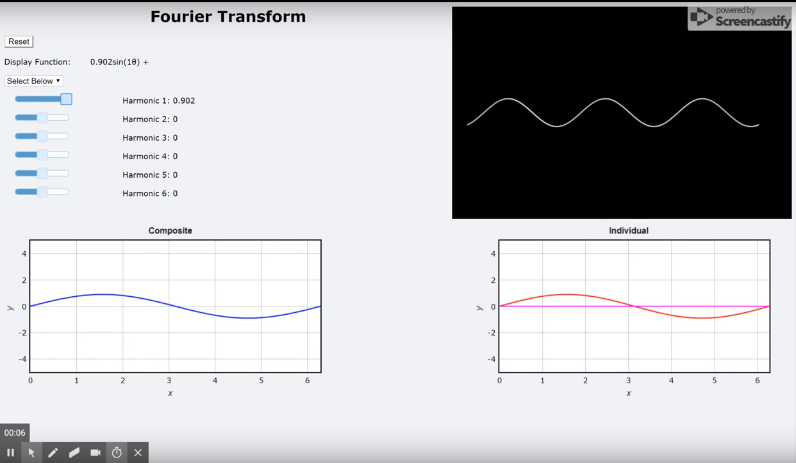

# VPython: Making Waves

## Purpose:

The purpose of this project is to create a simulation of the Fourier Transform which utilizes both audio and visuals to represent the interference and decomposition of waves. The simulation uses VPython, PyAudio, and Flask. Users should be able to adjust component waves or select preset waveforms, then hear and see the effects on the composite wave. Also includes a moving wave graph and mathematical approximation. 


## Install and Run

Platform Requirements: None, has been tested with Windows and Linux. 

To install the simulation, simply clone, configure, and run.

<b> Cloning from Github: </b> 

You should be able to clone our project straight from Github.

```git clone https://github.com/NNHSSE201718/vpython1```

<b> Installing the Libraries: </b> 

Simply run the command ```sudo sh install.sh``` in the command terminal.

<b> Running the simulation: </b> 

After running the script, everything you need will be automatically imported. You should be able to run the project simulation.

To demo the server run the command: ```python3 flaskServer.py```

This will create a locally hosted server on port 5000, you should be able to open the simulation in any web browser at http://localhost:5000

The simulation should look as pictured below:




## Developed by: 

The 2018 NNHS Software Engineering VPython team.

Adam Patni, Karen Ge, Emily Yang, Tarun Vellanki

